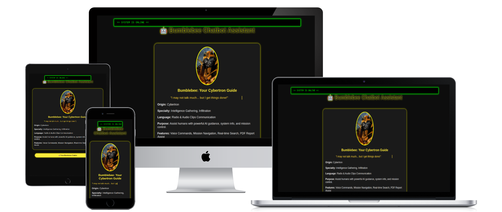

# 🤖 Bumble Bee Assistant – Voice-Powered Chatbot

A buzzing smart assistant built using HTML, JavaScript, and localStorage. Supports voice commands, animated typing, audio responses, chat history, export, and more!

---

## 🚀 Features

- 🎤 Voice Recognition – Speak your commands
- 💬 Smart Chatbot with developer-defined replies
- 📝 Animated Typing Effects
- 🔊 Custom Audio Clips per Command
- 🧠 Saves Chat to localStorage (chat persists on reload)
- 📄 Export Chat as PDF with timestamp
- 🌙 Light/Dark Theme Toggle
- 🧹 Clear Chat and 🔁 Reset Assistant
- 👤 Startup Form – Asks for your name
- 🐝 Bee Avatar Animation and Buzz Sound

---

## 📸 Project View



---

## 📂 Folder Structure

bumblebee-assistant/ ├── index.html ├── README.md └── sounds/ ├── buzz.mp3 ├── time.mp3 ├── joke.mp3 ├── name.mp3 └── google.mp3

---

## 📦 How to Use

### 1. Clone / Download the Project

```bash
git clone https://github.com/harshadteli/bumblebee-assistant.git

Or download the ZIP and extract.


---

2. Setup Audio Files in sounds/ Folder

Make sure to include:

File Description

buzz.mp3 Bee buzzing sound
time.mp3 Response to “what is the time”
joke.mp3 Response to “tell me a joke”
name.mp3 Response to “what is your name”
google.mp3 Response to “open Google”


---

3. Open the App

Open index.html in any modern browser.


---

4. Enter Your Name (Startup Form)

On first launch, the assistant will ask for your name.

Your name will be stored in localStorage and shown in chat.

All messages are saved locally until reset.


---

📤 Export Chat

Click on the 📄 Export Chat button to:

Generate a timestamped .pdf of your chat

A popup will confirm: ✅ “Chat history downloaded successfully!”


---

🧹 Reset Options

🧹 Clear Chat – Clears messages only

🔁 Reset Assistant – Clears chat + your name


---

🌙 Theme Support

Click the 🌞 / 🌚 icon (top-right) to toggle Light/Dark theme.


---

🗣️ Voice Commands (Examples)

Try saying or typing:

“What is the time?”

“Tell me a joke”

“Open Google”

“What is your name?”


The assistant will respond with voice + text and custom audio.


---

✅ Browser Compatibility

✅ Google Chrome

✅ Microsoft Edge

✅ Brave

❌ Firefox (no speech recognition)

❌ Safari (limited support)


Allow microphone permissions for best results.


```

## 📲 Live Demo

[](https://harshadteli.github.io/bumblebee-assistant/)
---

🧑‍💻 Developed By

- Harshad Teli 


## 🔗 Connect with Me

[](https://github.com/harshadteli)
[](https://www.linkedin.com/in/harshad-teli-560700330?utm_source=share&utm_campaign=share_via&utm_content=profile&utm_medium=android_app
)
[](https://www.instagram.com/ha.rshad4727?igsh=MTlmbHFkMTlnMnh2dQ==)
[](mailto:harshadteli697@gmail.com)
[](https://harshadteli.github.io/contactharshadteli/)
[](https://harshadteli.github.io/harshadteliportfolio/)
[](https://youtube.com/@harshtechaiworld?si=atZyhy8X8SAHiupw)

---

📜 License

This project do not have any license.

---

 <center><font color="blue"><small>&copy; 2025 HarshTech Organization | All rights reserved</small></font></center>
